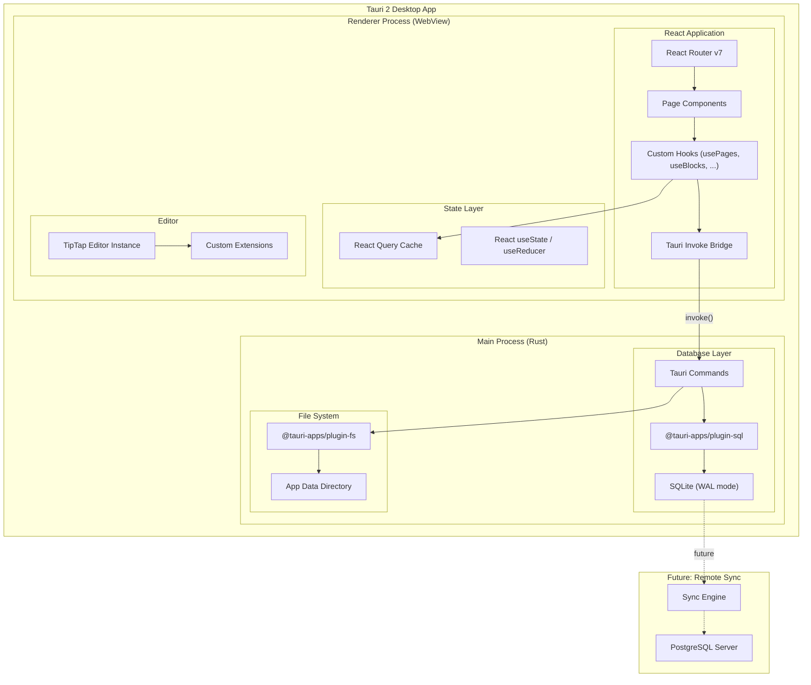
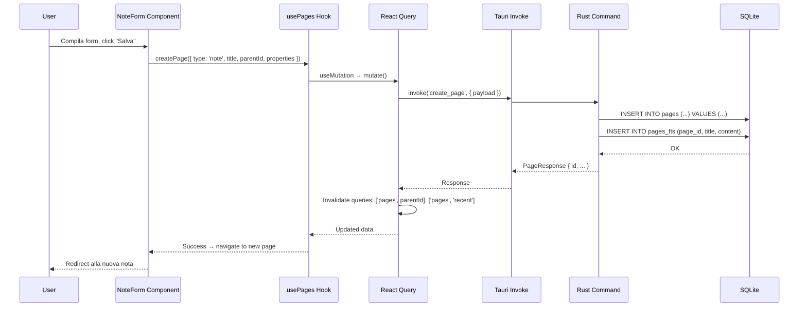
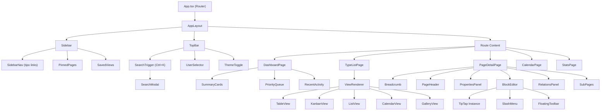
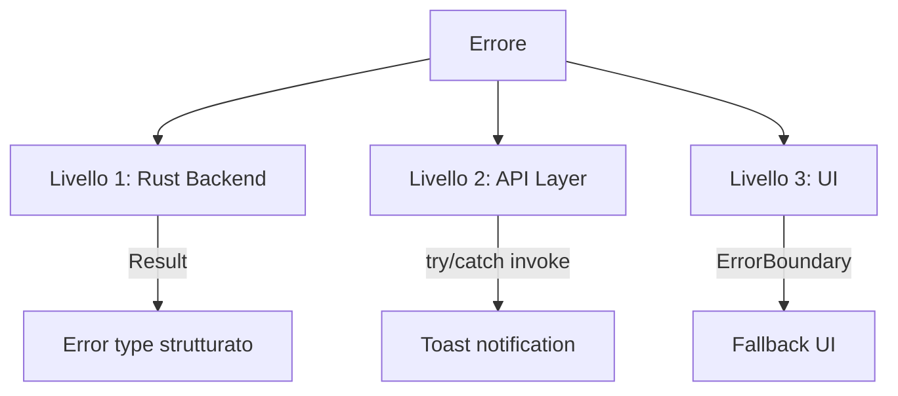

# Nution — Piano di Implementazione Dettagliato

**Filosofia: "Everything is a Page"** — Ogni entità (cliente, progetto, nota, bug, todo...) è una **pagina** con tipo, proprietà flessibili, contenuto a blocchi, gerarchia forte e correlazioni esplicite.

---

## Indice

1. [Giustificazione Scelte Tecnologiche](#1-giustificazione-scelte-tecnologiche)
2. [Architettura di Sistema](#2-architettura-di-sistema)
3. [Data Model — TypeScript Interfaces](#3-data-model--typescript-interfaces)
4. [Schema SQL Completo](#4-schema-sql-completo)
5. [Rust Backend — Structs & Commands](#5-rust-backend--structs--commands)
6. [API Contract](#6-api-contract)
7. [Architettura Componenti React](#7-architettura-componenti-react)
8. [State Management](#8-state-management)
9. [Gestione Errori](#9-gestione-errori)
10. [File Storage](#10-file-storage)
11. [Performance](#11-performance)
12. [Design System Dettagliato](#12-design-system-dettagliato)
13. [Struttura File](#13-struttura-file)
14. [Fasi di Sviluppo](#14-fasi-di-sviluppo)
15. [Verification Plan](#15-verification-plan)

---

## 1. Giustificazione Scelte Tecnologiche

### Tauri 2 vs Electron

| Criterio | Tauri 2 | Electron |
|----------|---------|----------|
| **Dimensione bundle** | ~3-8 MB | ~150-300 MB |
| **RAM a riposo** | ~30-50 MB | ~150-300 MB |
| **Backend** | Rust (nativo, sicuro, veloce) | Node.js (interpretato) |
| **WebView** | Sistema (Edge/WebKit/WebKitGTK) | Chromium bundled |
| **Sicurezza** | Sandboxed, permessi granulari | Accesso completo a Node.js |
| **Cross-platform** | ✅ Win/Mac/Linux/Mobile | ✅ Win/Mac/Linux |
| **Maturità** | v2 stabile (2024), ecosistema in crescita | Maturo (2013), vasto ecosistema |
| **AI locale** | Può invocare Ollama via process o HTTP | Idem, ma più pesante |

**Scelta: Tauri 2** — Per un tool aziendale interno che gira su macchine di lavoro, il footprint ridotto è cruciale. Tauri 2 usa la WebView di sistema (Edge su Windows, WebKit su macOS), evitando di bundlare un intero browser. Il backend Rust offre performance native per operazioni su database e file, con sicurezza memory-safe senza garbage collector. La v2 supporta anche build mobile (iOS/Android) se in futuro servisse un'app mobile.

> [!NOTE]
> **Rischio mitigato**: Tauri 2 usa la WebView di sistema, il che significa che il rendering può variare leggermente tra OS. Tuttavia, usando CSS standard e testando su tutti e tre gli OS, le differenze sono trascurabili per un'app interna.

---

### SQLite vs PostgreSQL (per la fase iniziale)

| Criterio | SQLite | PostgreSQL |
|----------|--------|------------|
| **Setup** | Zero — un singolo file `.db` | Server separato, configurazione |
| **Deploy** | Incluso nell'app | Richiede infrastruttura |
| **Offline** | ✅ Sempre disponibile | ❌ Richiede connessione |
| **Concorrenza** | Write lock singolo (WAL mode migliora) | Multi-writer, MVCC |
| **Full-text search** | FTS5 integrato | tsvector/tsquery integrato |
| **Performance** | Eccellente per single-user/small team | Eccellente per multi-user |
| **Backup** | Copia il file `.db` | pg_dump, replica |
| **Dimensione max** | ~281 TB (pratico: qualche GB) | Illimitato praticamente |

**Scelta: SQLite** — Per un'app desktop single-user/small-team, SQLite è la scelta perfetta: zero-config, embedded nel binario Tauri, funziona offline. Attivando **WAL mode** (Write-Ahead Logging), le letture non bloccano le scritture, ottimizzando la reattività dell'UI. La migrazione futura a PostgreSQL è facilitata dall'uso di Drizzle ORM che supporta entrambi con lo stesso codice TypeScript/API.

**Strategia futura multi-utente**: Quando servirà l'accesso remoto condiviso, si aggiungerà PostgreSQL come backend alternativo. L'app manterrà SQLite come cache locale e sincronizzerà con il server PostgreSQL (modello offline-first con sync). Il layer Drizzle ORM rende la transizione quasi trasparente per il frontend.

---

### TipTap vs Alternative per l'Editor a Blocchi

| Criterio | TipTap (ProseMirror) | Slate.js | Lexical (Meta) | BlockNote |
|----------|---------------------|----------|----------------|-----------|
| **Base** | ProseMirror | Custom | Custom (Meta) | TipTap wrapper |
| **Estendibilità** | Eccellente — plugin/nodo system | Buona ma verbosa | Buona, API diversa | Limitata (opininated) |
| **Block-based** | Nativo con NodeViews | Da costruire | Da costruire | Nativo |
| **Community** | Ampia, matura | Grande ma frammentata | In crescita (Meta) | Piccola |
| **Docs** | Eccellenti | Scarse | Buone | Buone |
| **TypeScript** | Nativo | Nativo | Nativo | Nativo |
| **Slash menu** | Plugin ufficiale | Da costruire | Da costruire | Built-in |
| **Collaborative** | Plugin Yjs | Plugin Yjs | Da costruire | Plugin Yjs |
| **React** | @tiptap/react ufficiale | React-native | lexical/react | React-native |

**Scelta: TipTap** — Offre il miglior equilibrio tra potenza e facilità d'uso. Basato su ProseMirror (lo stesso engine di Google Docs), TipTap fornisce un sistema di estensioni pulito per definire blocchi custom. Lo slash menu (`/`) e la floating toolbar sono disponibili come estensioni ufficiali. Il supporto React è first-class. BlockNote sarebbe più rapido da integrare ma limita la personalizzazione; Slate.js richiederebbe troppo boilerplate; Lexical è potente ma ha una API meno intuitiva per il nostro caso d'uso.

**Estensioni TipTap che useremo**:
- `@tiptap/starter-kit` — paragrafo, heading, bold, italic, lists, code, blockquote
- `@tiptap/extension-task-list` + `task-item` — checkbox/todo
- `@tiptap/extension-code-block-lowlight` — code block con syntax highlighting
- `@tiptap/extension-image` — immagini
- `@tiptap/extension-placeholder` — placeholder text
- `@tiptap/extension-slash-command` — menu `/` (custom)
- `@tiptap/extension-floating-menu` — toolbar floating
- `@tiptap/extension-link` — link
- `@tiptap/extension-horizontal-rule` — divider
- Estensioni custom: `CalloutNode`, `ToggleNode`, `DatabaseViewNode`, `PageReferenceNode`

---

### Drizzle ORM vs Alternative

| Criterio | Drizzle | Prisma | Kysely | TypeORM | Raw SQL |
|----------|---------|--------|--------|---------|---------|
| **Type safety** | ✅ Completa | ✅ Generata | ✅ Query builder | ⚠️ Parziale | ❌ |
| **Bundle size** | ~50 KB | ~2 MB + engine | ~100 KB | ~500 KB | 0 |
| **Performance** | Near-raw SQL | Overhead engine | Near-raw SQL | Overhead | Migliore |
| **SQLite support** | ✅ Nativo | ⚠️ Via driver | ✅ | ⚠️ | ✅ |
| **PostgreSQL** | ✅ | ✅ | ✅ | ✅ | ✅ |
| **Migrazioni** | ✅ drizzle-kit | ✅ prisma migrate | ❌ Manuale | ✅ | ❌ |
| **Filosofia** | SQL-first, thin wrapper | Schema-first, engine | Query builder puro | Active Record / Data Mapper | — |

**Scelta: Drizzle ORM** — È il più leggero e veloce tra gli ORM TypeScript, con type-safety completa a compile-time (non runtime). A differenza di Prisma che richiede un engine binario separato (~2 MB) e genera codice, Drizzle è un thin wrapper sopra SQL che non aggiunge overhead. La cosa cruciale: **supporta sia SQLite che PostgreSQL con lo stesso schema**, facilitando la migrazione futura. `drizzle-kit` fornisce migrazioni automatiche.

> [!IMPORTANT]
> **Nota su Drizzle in Tauri**: Drizzle gira nel contesto JavaScript. In Tauri 2, il frontend è JavaScript ma il backend è Rust. Abbiamo due opzioni:
> 1. **Drizzle nel frontend** via `@tauri-apps/plugin-sql` (il plugin Tauri SQL espone SQLite al JS)
> 2. **SQL nativo in Rust** via `rusqlite` nel backend, con Drizzle solo per i tipi TypeScript
>
> **Scelta: Opzione 1** per la Fase 1 (più rapida da sviluppare). Se emergono problemi di performance, migrare query critiche al Rust backend nella Fase 5.

---

### React Router vs TanStack Router

| Criterio | React Router v7 | TanStack Router |
|----------|-----------------|-----------------|
| **Type safety** | Parziale | ✅ Completa |
| **Data loading** | loader/action | Route-level loaders |
| **Maturità** | Molto maturo | Relativamente nuovo |
| **Bundle** | ~15 KB | ~12 KB |
| **Nested routes** | ✅ | ✅ |
| **Search params** | Stringa | ✅ Type-safe |

**Scelta: React Router v7** — Più maturo, documentazione abbondante, pattern ben noti. Per un'app desktop dove il routing è relativamente semplice (non ci sono URL pubblici da gestire), la type-safety dei search params di TanStack non giustifica il rischio di un ecosistema meno collaudato.

---

### @dnd-kit vs Alternative per Drag & Drop

**Scelta: @dnd-kit** — Unica libreria DnD moderna per React che supporta: sortable lists (riordinamento blocchi), transfer tra container (kanban column-to-column), keyboard accessibility, e touch support. `react-beautiful-dnd` è deprecated. `dnd-kit` è leggero (~12 KB), tree-shakeable, e ha un'API hooks-based pulita.

---

### Lucide vs Alternative per Icone

**Scelta: Lucide React** — Fork community-driven di Feather Icons con 1500+ icone, tutte come componenti React tree-shakeable. A differenza di FontAwesome (pesante, licenza), Heroicons (solo ~300 icone), o Material Icons (stile Google), Lucide ha un set completo con stile minimal coerente che si adatta a qualsiasi design system.

---

## 2. Architettura di Sistema



### Flusso Dati — Esempio: "Crea una Nota"



---

## 3. Data Model — TypeScript Interfaces

Queste interfacce definiscono il contratto tra frontend e backend. Ogni struct Rust corrisponde 1:1.

```typescript
// ============================================================
// src/lib/types.ts — Definizioni complete di tutte le entità
// ============================================================

// --- Identificatori e tipi base ---

/** UUID v4 come stringa */
type UUID = string;

/** Timestamp ISO 8601 */
type ISODateTime = string;

/** Livelli di priorità universali.
 *  Ogni pagina può avere una priorità che ne governa
 *  l'ordinamento nelle dashboard e nelle viste.
 *  Il valore numerico implicito (urgent=0, high=1, ...) 
 *  viene usato per il sort. */
type Priority = 'urgent' | 'high' | 'medium' | 'low' | 'none';

// --- Utenti ---

/** Utente del sistema (trust-based, nessuna password).
 *  L'utente si identifica al primo avvio e il suo ID
 *  viene salvato in localStorage. */
interface User {
  id: UUID;
  display_name: string;
  /** Colore HSL generato deterministicamente dal nome,
   *  usato come background dell'avatar circolare. */
  avatar_color: string;
  created_at: ISODateTime;
}

// --- Tipi di Pagina (Schema Registry) ---

/** Tipo di proprietà supportati nelle pagine.
 *  Ogni PropertyDefinition ha un tipo che determina 
 *  il widget di input nel form e la cella nella tabella. */
type PropertyType = 
  | 'text'           // Input testuale singola riga
  | 'rich_text'      // Textarea multi-riga
  | 'number'         // Input numerico con min/max opzionali
  | 'select'         // Dropdown singola scelta
  | 'multi_select'   // Multi-select con tag
  | 'date'           // Date picker
  | 'datetime'       // Date + time picker
  | 'checkbox'       // Boolean toggle
  | 'url'            // URL con validazione
  | 'email'          // Email con validazione
  | 'phone'          // Telefono
  | 'user'           // Picker utente (→ User.id)
  | 'page_reference' // Picker pagina (→ Page.id)
  | 'file';          // File attachment

/** Definizione di una singola proprietà nello schema di un PageType.
 *  Descrive il "campo" che ogni pagina di quel tipo può avere.
 *  È la definizione, non il valore — i valori sono in Page.properties. */
interface PropertyDefinition {
  /** Chiave univoca della proprietà nel tipo (es. "email", "severity") */
  key: string;
  /** Label visualizzata nell'UI */
  label: string;
  /** Tipo di dato e widget */
  type: PropertyType;
  /** Se true, il form non si può salvare senza questo campo */
  required: boolean;
  /** Valore di default quando si crea una nuova pagina */
  default_value?: unknown;
  /** Testo placeholder nel campo input */
  placeholder?: string;
  /** Per 'select' e 'multi_select': opzioni disponibili */
  options?: SelectOption[];
  /** Per 'number': valore minimo */
  min?: number;
  /** Per 'number': valore massimo */
  max?: number;
  /** Ordine di visualizzazione nel form e nella tabella */
  position: number;
  /** Se true, questa proprietà è visibile di default nelle viste tabella */
  show_in_table: boolean;
  /** Se true, questa proprietà è visibile nella card (gallery/kanban) */
  show_in_card: boolean;
}

/** Opzione per proprietà di tipo 'select' e 'multi_select' */
interface SelectOption {
  value: string;
  label: string;
  /** Colore del badge (HSL string) */
  color: string;
}

/** Definizione di uno stato nel flusso di lavoro.
 *  Ogni PageType ha un set di stati possibili con transizioni definite. */
interface StatusDefinition {
  /** Valore interno (es. "active", "in_progress") */
  value: string;
  /** Label visualizzata */
  label: string;
  /** Colore del badge di stato */
  color: string;
  /** Icona Lucide associata */
  icon?: string;
  /** A quali stati può transitare da questo */
  transitions_to: string[];
  /** Se true, è lo stato iniziale quando si crea una pagina */
  is_initial: boolean;
  /** Se true, è uno stato "finale" (completato, chiuso, ecc.) */
  is_terminal: boolean;
}

/** Tipo di pagina — definisce lo "schema" di un'entità.
 *  I tipi built-in (client, project, bug, ...) sono creati
 *  alla prima migrazione. L'utente può crearne di custom. */
interface PageType {
  id: UUID;
  /** Identificatore unico leggibile (es. "client", "bug") */
  name: string;
  /** Nome visualizzato (es. "Cliente", "Bug") */
  label: string;
  /** Nome plurale (es. "Clienti", "Bug") */
  label_plural: string;
  /** Nome icona Lucide (es. "user", "bug") */
  icon: string;
  /** Colore tema per il tipo (HSL string) */
  color: string;
  /** Schema delle proprietà — definisce quali campi ha questo tipo */
  properties_schema: PropertyDefinition[];
  /** Flusso di stati possibili */
  status_flow: StatusDefinition[];
  /** Quali tipi di pagina possono essere figli di questo tipo.
   *  Es. un 'client' può avere figli 'project' e 'commessa'.
   *  Array vuoto = qualsiasi tipo può essere figlio. */
  allowed_children_types: string[];
  /** Vista default quando si apre una lista di pagine di questo tipo */
  default_view_type: ViewDisplayType;
  /** Se true, tipo di sistema non eliminabile */
  is_system: boolean;
  /** Ordine nella sidebar */
  position: number;
  created_at: ISODateTime;
  updated_at: ISODateTime;
}

// --- Pagine (Entità universale) ---

/** Pagina — l'entità fondamentale del sistema.
 * 
 *  TUTTO è una Page: un cliente, un progetto, una nota, un bug.
 *  Il campo `type_id` determina il comportamento, le proprietà
 *  disponibili e le viste possibili.
 * 
 *  La gerarchia è modellata tramite `parent_id`:
 *  - Una pagina senza parent è una pagina root
 *  - Il campo `ancestors` (calcolato) contiene tutta la catena
 *    dalla root fino al parent diretto (per breadcrumb e query)
 * 
 *  Il campo `properties` è un oggetto JSON le cui chiavi
 *  corrispondono ai `key` del `properties_schema` del PageType. */
interface Page {
  id: UUID;
  /** Tipo della pagina (→ PageType.id) */
  type_id: UUID;
  /** Parent nella gerarchia (→ Page.id, null = root) */
  parent_id: UUID | null;
  /** Titolo della pagina */
  title: string;
  /** Emoji o nome icona Lucide per override dell'icona del tipo */
  icon: string | null;
  /** URL immagine di copertina (path locale o URL) */
  cover_url: string | null;
  /** Valori delle proprietà. 
   *  Chiavi = PropertyDefinition.key, Valori = tipizzati per PropertyType.
   *  Es: { "email": "info@acme.it", "severity": "high", "due_date": "2024-03-15" } */
  properties: Record<string, unknown>;
  /** Priorità universale — governa ordinamento nelle dashboard */
  priority: Priority;
  /** Stato corrente (deve essere un valore valido nel status_flow del tipo) */
  status: string;
  /** Ordine tra i siblings con lo stesso parent */
  position: number;
  /** Se true, appare nella sezione "Preferiti" della sidebar */
  is_pinned: boolean;
  /** Se true, nascosta dalle viste normali (visibile solo con filtro) */
  is_archived: boolean;
  /** Utente che ha creato la pagina */
  created_by: UUID;
  /** Ultimo utente che ha modificato la pagina */
  updated_by: UUID;
  created_at: ISODateTime;
  updated_at: ISODateTime;
}

/** Pagina con dati relazionali inclusi — usata nelle viste.
 *  Estende Page con informazioni calcolate/joined. */
interface PageWithDetails extends Page {
  /** Nome del tipo (joined da page_types) */
  type_name: string;
  /** Icona del tipo */
  type_icon: string;
  /** Colore del tipo */
  type_color: string;
  /** Label dello stato corrente (joined da status_flow) */
  status_label: string;
  /** Colore dello stato */
  status_color: string;
  /** Nome dell'utente creatore */
  created_by_name: string;
  /** Nome dell'ultimo modificatore */
  updated_by_name: string;
  /** Catena di antenati dalla root al parent diretto.
   *  Usata per il breadcrumb e per query come 
   *  "tutte le note del cliente X". */
  ancestors: PageAncestor[];
  /** Numero di figli diretti */
  children_count: number;
  /** Numero di relazioni */
  relations_count: number;
}

/** Antenato nella catena gerarchica — per breadcrumb */
interface PageAncestor {
  id: UUID;
  title: string;
  icon: string | null;
  type_name: string;
  type_icon: string;
}

// --- Blocchi (Contenuto delle Pagine) ---

/** Tipo di blocco nell'editor.
 *  Ogni tipo corrisponde a un Node TipTap. */
type BlockType =
  | 'paragraph'
  | 'heading1'
  | 'heading2'
  | 'heading3'
  | 'bullet_list'
  | 'numbered_list'
  | 'todo'
  | 'code'
  | 'image'
  | 'divider'
  | 'quote'
  | 'callout'
  | 'toggle'
  | 'database_view'    // Vista inline di un database/query
  | 'page_reference';  // Link/embed di un'altra pagina

/** Blocco di contenuto — unità atomica dell'editor.
 * 
 *  I blocchi sono salvati come JSON nel DB e convertiti
 *  in nodi TipTap al caricamento. La struttura `content`
 *  varia per tipo:
 *  
 *  - paragraph: { text: string, marks: Mark[] }
 *  - heading: { text: string, level: 1|2|3 }
 *  - todo: { text: string, checked: boolean }
 *  - code: { code: string, language: string }
 *  - image: { src: string, alt: string, caption: string }
 *  - callout: { text: string, emoji: string, color: string }
 *  - database_view: { view_id: UUID }
 *  - page_reference: { page_id: UUID, display: 'link' | 'embed' }
 */
interface Block {
  id: UUID;
  /** Pagina che contiene questo blocco */
  page_id: UUID;
  /** Blocco parent per nesting (es. items dentro un toggle) */
  parent_block_id: UUID | null;
  /** Tipo di blocco */
  type: BlockType;
  /** Contenuto strutturato (schema varia per tipo) */
  content: Record<string, unknown>;
  /** Ordine all'interno del parent */
  position: number;
  created_at: ISODateTime;
  updated_at: ISODateTime;
}

// --- Relazioni tra Pagine ---

/** Tipo di relazione tra due pagine.
 *  Tutte le relazioni sono bidirezionali nell'UI:
 *  se A "blocca" B, nella pagina di B si vedrà "bloccato da A". */
type RelationType = 
  | 'reference'   // "fa riferimento a" / "referenziato da"
  | 'blocks'      // "blocca" / "bloccato da"
  | 'depends_on'  // "dipende da" / "prerequisito di"
  | 'related'     // "correlato a" (simmetrica)
  | 'duplicate';  // "duplicato di" (simmetrica)

/** Relazione esplicita tra due pagine.
 *  A differenza di Notion dove le relazioni sono proprietà
 *  di un database, qui sono entità first-class navigabili
 *  da entrambi i lati. */
interface PageRelation {
  id: UUID;
  /** Pagina sorgente della relazione */
  source_id: UUID;
  /** Pagina destinazione */
  target_id: UUID;
  /** Tipo di relazione */
  relation_type: RelationType;
  /** Nota testuale opzionale che spiega la relazione */
  description: string | null;
  created_by: UUID;
  created_at: ISODateTime;
}

/** Relazione con dati della pagina collegata — per il pannello relazioni */
interface PageRelationWithTarget extends PageRelation {
  /** Dati della pagina collegata (target se vista da source, source se vista da target) */
  linked_page: {
    id: UUID;
    title: string;
    icon: string | null;
    type_name: string;
    type_icon: string;
    type_color: string;
    status: string;
    status_label: string;
    status_color: string;
  };
  /** Direzione: true se questa pagina è il source, false se è il target */
  is_outgoing: boolean;
}

// --- Viste Personalizzate ---

/** Tipo di visualizzazione disponibile */
type ViewDisplayType = 'table' | 'kanban' | 'list' | 'calendar' | 'gallery';

/** Operatore per i filtri */
type FilterOperator = 
  | 'equals' | 'not_equals'
  | 'contains' | 'not_contains'
  | 'starts_with' | 'ends_with'
  | 'greater_than' | 'less_than'
  | 'is_empty' | 'is_not_empty'
  | 'in' | 'not_in'
  | 'between';

/** Singolo filtro in una vista */
interface ViewFilter {
  /** Proprietà su cui filtrare. Valori speciali:
   *  - "type": filtra per tipo di pagina
   *  - "status": filtra per stato
   *  - "priority": filtra per priorità
   *  - "created_by": filtra per creatore
   *  - "created_at": filtra per data creazione
   *  - "updated_at": filtra per data modifica
   *  - qualsiasi PropertyDefinition.key per proprietà custom */
  property: string;
  operator: FilterOperator;
  value: unknown;
  /** Se presente, questo filtro è in AND/OR con il successivo */
  conjunction: 'and' | 'or';
}

/** Definizione di ordinamento */
interface ViewSort {
  property: string;
  direction: 'asc' | 'desc';
}

/** Vista personalizzata salvata.
 * 
 *  Le viste sono query salvate che possono essere mostrate
 *  in diversi formati. Possono avere scope:
 *  - "global": mostra pagine di qualsiasi tipo
 *  - "type": mostra solo pagine di un tipo specifico
 *  - "page": mostra solo sotto-pagine di una pagina specifica
 */
interface View {
  id: UUID;
  name: string;
  /** Tipo di visualizzazione */
  display_type: ViewDisplayType;
  /** Filtri applicati (combinabili con AND/OR) */
  filters: ViewFilter[];
  /** Ordinamento (multiplo, con priorità) */
  sort_by: ViewSort[];
  /** Proprietà per raggruppamento (per kanban: lo stato o un select) */
  group_by: string | null;
  /** Proprietà visibili nella vista (ordinate).
   *  Per table: colonne mostrate.
   *  Per kanban/gallery: proprietà nella card. */
  visible_properties: string[];
  /** Ambito della vista */
  scope_type: 'global' | 'type' | 'page';
  /** ID del tipo o della pagina (dipende da scope_type) */
  scope_id: UUID | null;
  /** Se true, è la vista di default per lo scope */
  is_default: boolean;
  position: number;
  created_by: UUID;
  created_at: ISODateTime;
  updated_at: ISODateTime;
}

// --- Form ---

/** Campo in un form — referenzia una PropertyDefinition */
interface FormField {
  /** Chiave della proprietà nello schema del tipo */
  property_key: string;
  /** Override della label (se diversa dalla PropertyDefinition) */
  label_override: string | null;
  /** Se true, campo obbligatorio nel form (override) */
  required: boolean;
  /** Valore di default nel form (override) */
  default_value: unknown;
  /** Placeholder (override) */
  placeholder: string | null;
  /** Ordine nel form */
  position: number;
  /** Se true, campo visibile nel form. Se false, nascosto. */
  visible: boolean;
}

/** Form personalizzato per inserimento guidato */
interface Form {
  id: UUID;
  name: string;
  /** Tipo di pagina che il form crea (→ PageType.id) */
  page_type_id: UUID;
  /** Campi del form (ordinati per position) */
  fields: FormField[];
  /** Se specificato, le pagine create avranno questo parent */
  default_parent_id: UUID | null;
  /** Se true, form compatto per quick-add (meno campi, inline) */
  is_quick_form: boolean;
  /** Se true, include il campo "titolo" nel form (sempre true per quick) */
  include_title: boolean;
  /** Se true, include l'editor di contenuto sotto al form */
  include_content: boolean;
  created_by: UUID;
  created_at: ISODateTime;
  updated_at: ISODateTime;
}

// --- Full-text Search ---

/** Risultato di una ricerca full-text */
interface SearchResult {
  page_id: UUID;
  title: string;
  /** Snippet del contenuto con termini evidenziati (<mark>) */
  snippet: string;
  /** Punteggio di rilevanza (BM25 da FTS5) */
  rank: number;
  /** Dati contestuali */
  type_name: string;
  type_icon: string;
  type_color: string;
  /** Breadcrumb testuale: "ACME > Progetto Alfa" */
  breadcrumb: string;
  updated_at: ISODateTime;
}

// --- Request/Response per le API ---

/** Payload per creare una pagina */
interface CreatePageRequest {
  type_id: UUID;
  parent_id: UUID | null;
  title: string;
  icon?: string;
  properties?: Record<string, unknown>;
  priority?: Priority;
  status?: string;
}

/** Payload per aggiornare una pagina */
interface UpdatePageRequest {
  id: UUID;
  title?: string;
  icon?: string | null;
  cover_url?: string | null;
  properties?: Record<string, unknown>;
  priority?: Priority;
  status?: string;
  parent_id?: UUID | null;
  position?: number;
  is_pinned?: boolean;
  is_archived?: boolean;
}

/** Parametri per query pagine con filtri */
interface QueryPagesRequest {
  /** Filtra per tipo (nome del tipo, es. "note", "bug") */
  type_name?: string;
  /** Filtra per parent (tutte le sotto-pagine dirette) */
  parent_id?: UUID;
  /** Filtra per antenato (tutte le pagine discendenti, a qualsiasi livello) */
  ancestor_id?: UUID;
  /** Filtri custom */
  filters?: ViewFilter[];
  /** Ordinamento (default: priority ASC, updated_at DESC) */
  sort_by?: ViewSort[];
  /** Paginazione: offset */
  offset?: number;
  /** Paginazione: limite (default 50, max 200) */
  limit?: number;
  /** Se true, includi pagine archiviate */
  include_archived?: boolean;
}

/** Risposta paginata */
interface PaginatedResponse<T> {
  items: T[];
  total: number;
  offset: number;
  limit: number;
  has_more: boolean;
}
```

---

## 4. Schema SQL Completo

```sql
-- ============================================================
-- Schema SQLite per Nution
-- Ogni tabella include commenti esplicativi.
-- ============================================================

-- Abilita WAL mode per performance (letture non bloccano scritture)
PRAGMA journal_mode = WAL;

-- Abilita foreign keys (disabilitate di default in SQLite)
PRAGMA foreign_keys = ON;

-- -----------------------------------------------------------
-- USERS: Utenti del sistema (trust-based, nessuna password)
-- -----------------------------------------------------------
CREATE TABLE users (
    id          TEXT PRIMARY KEY,                -- UUID v4
    display_name TEXT NOT NULL,
    avatar_color TEXT NOT NULL,                  -- HSL string, es. "hsl(210, 60%, 50%)"
    created_at  TEXT NOT NULL DEFAULT (datetime('now'))
);

-- -----------------------------------------------------------
-- PAGE_TYPES: Schema registry dei tipi di pagina.
-- Ogni tipo definisce quali proprietà e stati ha una pagina.
-- I tipi built-in (client, project, ...) sono inseriti dalla migrazione.
-- L'utente può aggiungere tipi custom.
-- -----------------------------------------------------------
CREATE TABLE page_types (
    id                  TEXT PRIMARY KEY,
    name                TEXT NOT NULL UNIQUE,     -- "client", "project", "bug", ...
    label               TEXT NOT NULL,            -- "Cliente", "Progetto", "Bug"
    label_plural        TEXT NOT NULL,            -- "Clienti", "Progetti", "Bug"
    icon                TEXT NOT NULL,            -- Nome icona Lucide
    color               TEXT NOT NULL,            -- HSL string
    properties_schema   TEXT NOT NULL DEFAULT '[]',   -- JSON: PropertyDefinition[]
    status_flow         TEXT NOT NULL DEFAULT '[]',   -- JSON: StatusDefinition[]
    allowed_children    TEXT NOT NULL DEFAULT '[]',   -- JSON: string[] (nomi tipi figli ammessi)
    default_view_type   TEXT NOT NULL DEFAULT 'table',
    is_system           INTEGER NOT NULL DEFAULT 0,   -- 1 = built-in, non eliminabile
    position            INTEGER NOT NULL DEFAULT 0,
    created_at          TEXT NOT NULL DEFAULT (datetime('now')),
    updated_at          TEXT NOT NULL DEFAULT (datetime('now'))
);

-- -----------------------------------------------------------
-- PAGES: L'entità fondamentale — tutto è una pagina.
-- La gerarchia è modellata con parent_id (self-referencing FK).
-- Il client_id denormalizzato accelera le query "per cliente"
-- senza dover risalire la catena ogni volta.
-- -----------------------------------------------------------
CREATE TABLE pages (
    id          TEXT PRIMARY KEY,
    type_id     TEXT NOT NULL REFERENCES page_types(id),
    parent_id   TEXT REFERENCES pages(id) ON DELETE CASCADE,
    title       TEXT NOT NULL,
    icon        TEXT,                            -- Override icona del tipo
    cover_url   TEXT,
    properties  TEXT NOT NULL DEFAULT '{}',      -- JSON: Record<string, unknown>
    priority    TEXT NOT NULL DEFAULT 'none'
                CHECK (priority IN ('urgent','high','medium','low','none')),
    status      TEXT NOT NULL DEFAULT '',
    position    INTEGER NOT NULL DEFAULT 0,
    is_pinned   INTEGER NOT NULL DEFAULT 0,
    is_archived INTEGER NOT NULL DEFAULT 0,
    created_by  TEXT NOT NULL REFERENCES users(id),
    updated_by  TEXT NOT NULL REFERENCES users(id),
    created_at  TEXT NOT NULL DEFAULT (datetime('now')),
    updated_at  TEXT NOT NULL DEFAULT (datetime('now')),

    -- Campi denormalizzati per query veloci:
    -- Il "root ancestor" di tipo 'client' permette di fare
    -- "SELECT * FROM pages WHERE root_client_id = ?" 
    -- senza recursive CTE ogni volta.
    root_client_id TEXT REFERENCES pages(id) ON DELETE SET NULL
);

-- Indici per le query più comuni
CREATE INDEX idx_pages_type ON pages(type_id);
CREATE INDEX idx_pages_parent ON pages(parent_id);
CREATE INDEX idx_pages_status ON pages(status);
CREATE INDEX idx_pages_priority ON pages(priority);
CREATE INDEX idx_pages_root_client ON pages(root_client_id);
CREATE INDEX idx_pages_pinned ON pages(is_pinned) WHERE is_pinned = 1;
CREATE INDEX idx_pages_updated ON pages(updated_at DESC);
-- Indice composto per la query "ultime 4 note di un cliente":
CREATE INDEX idx_pages_client_type_updated 
    ON pages(root_client_id, type_id, updated_at DESC)
    WHERE is_archived = 0;

-- -----------------------------------------------------------
-- PAGE_ANCESTORS: Tabella di chiusura (closure table) per
-- la gerarchia. Permette query efficienti tipo:
-- "tutti i discendenti di X" o "tutti gli antenati di Y"
-- senza recursive CTE.
--
-- Per ogni pagina, contiene una riga per ogni antenato
-- (inclusa se stessa con depth=0).
-- -----------------------------------------------------------
CREATE TABLE page_ancestors (
    page_id     TEXT NOT NULL REFERENCES pages(id) ON DELETE CASCADE,
    ancestor_id TEXT NOT NULL REFERENCES pages(id) ON DELETE CASCADE,
    depth       INTEGER NOT NULL,  -- 0 = se stessa, 1 = parent, 2 = nonno, ...
    PRIMARY KEY (page_id, ancestor_id)
);

CREATE INDEX idx_ancestors_ancestor ON page_ancestors(ancestor_id, depth);

-- -----------------------------------------------------------
-- BLOCKS: Contenuto delle pagine — blocchi dell'editor.
-- Salvati come JSON strutturato, convertiti in nodi TipTap.
-- -----------------------------------------------------------
CREATE TABLE blocks (
    id              TEXT PRIMARY KEY,
    page_id         TEXT NOT NULL REFERENCES pages(id) ON DELETE CASCADE,
    parent_block_id TEXT REFERENCES blocks(id) ON DELETE CASCADE,
    type            TEXT NOT NULL,
    content         TEXT NOT NULL DEFAULT '{}',   -- JSON
    position        INTEGER NOT NULL DEFAULT 0,
    created_at      TEXT NOT NULL DEFAULT (datetime('now')),
    updated_at      TEXT NOT NULL DEFAULT (datetime('now'))
);

CREATE INDEX idx_blocks_page ON blocks(page_id, position);
CREATE INDEX idx_blocks_parent ON blocks(parent_block_id);

-- -----------------------------------------------------------
-- PAGE_RELATIONS: Relazioni esplicite tra pagine.
-- Bidirezionali nell'UI ma salvate con direzione nel DB.
-- Un UNIQUE constraint previene duplicati.
-- -----------------------------------------------------------
CREATE TABLE page_relations (
    id              TEXT PRIMARY KEY,
    source_id       TEXT NOT NULL REFERENCES pages(id) ON DELETE CASCADE,
    target_id       TEXT NOT NULL REFERENCES pages(id) ON DELETE CASCADE,
    relation_type   TEXT NOT NULL 
                    CHECK (relation_type IN ('reference','blocks','depends_on','related','duplicate')),
    description     TEXT,
    created_by      TEXT NOT NULL REFERENCES users(id),
    created_at      TEXT NOT NULL DEFAULT (datetime('now')),

    -- Previeni relazioni duplicate (stessa coppia e tipo)
    UNIQUE (source_id, target_id, relation_type),
    -- Previeni auto-relazioni
    CHECK (source_id != target_id)
);

CREATE INDEX idx_relations_source ON page_relations(source_id);
CREATE INDEX idx_relations_target ON page_relations(target_id);

-- -----------------------------------------------------------
-- VIEWS: Viste personalizzate salvate.
-- -----------------------------------------------------------
CREATE TABLE views (
    id                  TEXT PRIMARY KEY,
    name                TEXT NOT NULL,
    display_type        TEXT NOT NULL 
                        CHECK (display_type IN ('table','kanban','list','calendar','gallery')),
    filters             TEXT NOT NULL DEFAULT '[]',     -- JSON: ViewFilter[]
    sort_by             TEXT NOT NULL DEFAULT '[]',     -- JSON: ViewSort[]
    group_by            TEXT,                           -- Property key o null
    visible_properties  TEXT NOT NULL DEFAULT '[]',     -- JSON: string[]
    scope_type          TEXT NOT NULL DEFAULT 'global'
                        CHECK (scope_type IN ('global','type','page')),
    scope_id            TEXT,
    is_default          INTEGER NOT NULL DEFAULT 0,
    position            INTEGER NOT NULL DEFAULT 0,
    created_by          TEXT NOT NULL REFERENCES users(id),
    created_at          TEXT NOT NULL DEFAULT (datetime('now')),
    updated_at          TEXT NOT NULL DEFAULT (datetime('now'))
);

-- -----------------------------------------------------------
-- FORMS: Form personalizzati per inserimento guidato.
-- -----------------------------------------------------------
CREATE TABLE forms (
    id                  TEXT PRIMARY KEY,
    name                TEXT NOT NULL,
    page_type_id        TEXT NOT NULL REFERENCES page_types(id),
    fields              TEXT NOT NULL DEFAULT '[]',     -- JSON: FormField[]
    default_parent_id   TEXT REFERENCES pages(id) ON DELETE SET NULL,
    is_quick_form       INTEGER NOT NULL DEFAULT 0,
    include_title       INTEGER NOT NULL DEFAULT 1,
    include_content     INTEGER NOT NULL DEFAULT 0,
    created_by          TEXT NOT NULL REFERENCES users(id),
    created_at          TEXT NOT NULL DEFAULT (datetime('now')),
    updated_at          TEXT NOT NULL DEFAULT (datetime('now'))
);

-- -----------------------------------------------------------
-- PAGES_FTS: Tabella FTS5 per ricerca full-text.
-- Sincronizzata tramite trigger INSERT/UPDATE/DELETE su pages e blocks.
-- FTS5 usa l'algoritmo BM25 per il ranking.
-- -----------------------------------------------------------
CREATE VIRTUAL TABLE pages_fts USING fts5(
    page_id UNINDEXED,    -- Non indicizzato, solo per il JOIN
    title,                 -- Peso maggiore nel ranking
    content,               -- Testo aggregato dei blocchi
    content=''             -- Contentless: non duplica i dati, solo l'indice
);

-- -----------------------------------------------------------
-- TRIGGER: Sincronizzazione automatica dati denormalizzati
-- -----------------------------------------------------------

-- Aggiorna updated_at automaticamente su modifica pagina
CREATE TRIGGER pages_updated_at
    AFTER UPDATE ON pages
    FOR EACH ROW
    WHEN OLD.updated_at = NEW.updated_at
BEGIN
    UPDATE pages SET updated_at = datetime('now') WHERE id = NEW.id;
END;

-- Aggiorna updated_at blocchi
CREATE TRIGGER blocks_updated_at
    AFTER UPDATE ON blocks
    FOR EACH ROW
    WHEN OLD.updated_at = NEW.updated_at
BEGIN
    UPDATE blocks SET updated_at = datetime('now') WHERE id = NEW.id;
END;
```

---

## 5. Rust Backend — Structs & Commands

I Tauri commands sono funzioni Rust invocabili dal frontend via `invoke()`. Ogni comando è annotato con `#[tauri::command]`.

```rust
// src-tauri/src/commands/pages.rs

use serde::{Deserialize, Serialize};
use tauri::State;
use crate::db::DbPool;

/// Corrisponde a CreatePageRequest nel frontend.
/// serde rinomina i campi in camelCase per il JS.
#[derive(Debug, Deserialize)]
#[serde(rename_all = "camelCase")]
pub struct CreatePagePayload {
    pub type_id: String,
    pub parent_id: Option<String>,
    pub title: String,
    pub icon: Option<String>,
    pub properties: Option<serde_json::Value>,
    pub priority: Option<String>,
    pub status: Option<String>,
}

/// Risposta con i dati della pagina creata/aggiornata.
#[derive(Debug, Serialize)]
#[serde(rename_all = "camelCase")]
pub struct PageResponse {
    pub id: String,
    pub type_id: String,
    pub parent_id: Option<String>,
    pub title: String,
    pub icon: Option<String>,
    pub cover_url: Option<String>,
    pub properties: serde_json::Value,
    pub priority: String,
    pub status: String,
    pub position: i32,
    pub is_pinned: bool,
    pub is_archived: bool,
    pub created_by: String,
    pub updated_by: String,
    pub created_at: String,
    pub updated_at: String,
    pub root_client_id: Option<String>,
}

/// Crea una nuova pagina.
/// 
/// Flusso:
/// 1. Genera UUID
/// 2. Determina lo stato iniziale dal status_flow del tipo
/// 3. Calcola root_client_id risalendo la catena parent
/// 4. INSERT nella tabella pages
/// 5. Inserisce record in page_ancestors (closure table)
/// 6. Aggiorna l'indice FTS5
/// 7. Restituisce la pagina creata
#[tauri::command]
pub async fn create_page(
    payload: CreatePagePayload,
    user_id: String,          // Passato dal frontend
    db: State<'_, DbPool>,
) -> Result<PageResponse, String> {
    // Implementazione...
    todo!()
}

/// Recupera una pagina con tutti i dettagli (joined).
/// Include ancestors per il breadcrumb.
#[tauri::command]
pub async fn get_page(
    id: String,
    db: State<'_, DbPool>,
) -> Result<PageWithDetailsResponse, String> {
    todo!()
}

/// Query pagine con filtri, ordinamento, paginazione.
/// Supporta tutti i filtri definiti in ViewFilter.
#[tauri::command]
pub async fn query_pages(
    request: QueryPagesPayload,
    db: State<'_, DbPool>,
) -> Result<PaginatedResponse<PageWithDetailsResponse>, String> {
    todo!()
}

/// Aggiorna una pagina (partial update).
/// Aggiorna anche: updated_by, updated_at, FTS5,
/// e root_client_id se parent_id cambia.
#[tauri::command]
pub async fn update_page(
    payload: UpdatePagePayload,
    user_id: String,
    db: State<'_, DbPool>,
) -> Result<PageResponse, String> {
    todo!()
}

/// Elimina una pagina e tutte le sotto-pagine (CASCADE).
/// Rimuove anche da page_ancestors e FTS5.
#[tauri::command]
pub async fn delete_page(
    id: String,
    db: State<'_, DbPool>,
) -> Result<(), String> {
    todo!()
}

/// Ritorna le ultime N note modificate per un dato client.
/// Usata nella Vista Clienti (card con ultime 4 note).
/// 
/// Query ottimizzata grazie all'indice:
///   idx_pages_client_type_updated(root_client_id, type_id, updated_at DESC)
#[tauri::command]
pub async fn get_recent_notes_for_client(
    client_id: String,
    limit: Option<i32>,           // Default: 4
    include_completed: bool,      // Toggle progetti completati
    db: State<'_, DbPool>,
) -> Result<Vec<PageWithDetailsResponse>, String> {
    todo!()
}
```

### Elenco Completo Tauri Commands

| Modulo | Comando | Descrizione |
|--------|---------|-------------|
| **pages** | `create_page` | Crea pagina con closure table + FTS |
| | `get_page` | Dettaglio con ancestors (breadcrumb) |
| | `query_pages` | Query con filtri/sort/pagination |
| | `update_page` | Partial update + ricalcolo FTS |
| | `delete_page` | Cascade delete + cleanup |
| | `move_page` | Cambia parent + ricalcola ancestors |
| | `reorder_pages` | Riordina siblings (drag) |
| | `get_recent_notes_for_client` | Ultime N note per cliente |
| | `get_page_children` | Sotto-pagine dirette |
| | `get_page_descendants` | Tutti i discendenti (via closure table) |
| **blocks** | `get_blocks` | Blocchi di una pagina (ordinati) |
| | `save_blocks` | Salva tutti i blocchi (replace batch) |
| | `sync_fts` | Aggiorna indice FTS dopo edit |
| **relations** | `create_relation` | Crea relazione bidirezionale |
| | `get_relations` | Relazioni di una pagina (entrambe le direzioni) |
| | `delete_relation` | Rimuovi relazione |
| **views** | `create_view` | Crea vista personalizzata |
| | `get_views` | Lista viste salvate |
| | `update_view` | Aggiorna filtri/sort/display |
| | `delete_view` | Elimina vista |
| | `execute_view` | Esegue la query della vista → risultati |
| **forms** | `create_form` | Crea form personalizzato |
| | `get_forms` | Lista form |
| | `update_form` | Aggiorna form |
| | `delete_form` | Elimina form |
| **page_types** | `get_page_types` | Lista tutti i tipi |
| | `create_page_type` | Crea tipo custom |
| | `update_page_type` | Modifica schema/status |
| **users** | `get_users` | Lista utenti |
| | `create_user` | Registra utente (trust-based) |
| | `get_or_create_user` | Login trust-based |
| **search** | `search` | Ricerca FTS5 con ranking BM25 |
| **files** | `upload_file` | Salva file in app data dir |
| | `get_file_path` | Path locale di un file |
| **stats** | `get_client_stats` | Statistiche per cliente |
| | `get_global_stats` | Statistiche globali |
| | `get_activity_timeline` | Timeline attività recente |

---

## 6. API Contract — Wrapper Frontend

```typescript
// src/lib/api.ts
// Wrapper type-safe sopra Tauri invoke()

import { invoke } from '@tauri-apps/api/core';
import type {
  Page, PageWithDetails, Block, PageRelation, View, Form,
  User, PageType, SearchResult,
  CreatePageRequest, UpdatePageRequest, QueryPagesRequest,
  PaginatedResponse,
} from './types';

/** Modulo API per le Pagine */
export const pagesApi = {
  create: (req: CreatePageRequest, userId: string) =>
    invoke<Page>('create_page', { payload: req, userId }),

  get: (id: string) =>
    invoke<PageWithDetails>('get_page', { id }),

  query: (req: QueryPagesRequest) =>
    invoke<PaginatedResponse<PageWithDetails>>('query_pages', { request: req }),

  update: (req: UpdatePageRequest, userId: string) =>
    invoke<Page>('update_page', { payload: req, userId }),

  delete: (id: string) =>
    invoke<void>('delete_page', { id }),

  move: (id: string, newParentId: string | null, position: number) =>
    invoke<void>('move_page', { id, newParentId, position }),

  getChildren: (parentId: string) =>
    invoke<PageWithDetails[]>('get_page_children', { parentId }),

  getRecentNotesForClient: (clientId: string, limit?: number, includeCompleted?: boolean) =>
    invoke<PageWithDetails[]>('get_recent_notes_for_client', { 
      clientId, limit: limit ?? 4, includeCompleted: includeCompleted ?? false 
    }),
};

/** Modulo API per i Blocchi */
export const blocksApi = {
  get: (pageId: string) =>
    invoke<Block[]>('get_blocks', { pageId }),

  /** Salva l'intero contenuto della pagina in un'unica operazione.
   *  Strategia "replace all": elimina i vecchi blocchi e inserisce i nuovi.
   *  Questo semplifica la logica di sync tra TipTap e il DB. */
  save: (pageId: string, blocks: Block[], userId: string) =>
    invoke<void>('save_blocks', { pageId, blocks, userId }),
};

/** Modulo API per le Relazioni */
export const relationsApi = {
  create: (sourceId: string, targetId: string, type: string, description?: string, userId?: string) =>
    invoke<PageRelation>('create_relation', { sourceId, targetId, relationType: type, description, userId }),

  getForPage: (pageId: string) =>
    invoke<PageRelationWithTarget[]>('get_relations', { pageId }),

  delete: (id: string) =>
    invoke<void>('delete_relation', { id }),
};

/** Modulo API per le Viste */
export const viewsApi = {
  create: (view: Omit<View, 'id' | 'created_at' | 'updated_at'>) =>
    invoke<View>('create_view', { view }),

  getAll: () =>
    invoke<View[]>('get_views', {}),

  update: (view: Partial<View> & { id: string }) =>
    invoke<View>('update_view', { view }),

  delete: (id: string) =>
    invoke<void>('delete_view', { id }),

  /** Esegue la query definita dalla vista e ritorna i risultati */
  execute: (viewId: string, offset?: number, limit?: number) =>
    invoke<PaginatedResponse<PageWithDetails>>('execute_view', { viewId, offset, limit }),
};

export const searchApi = {
  search: (query: string, limit?: number) =>
    invoke<SearchResult[]>('search', { query, limit: limit ?? 20 }),
};

// ... formsApi, usersApi, pageTypesApi, statsApi analoghi
```

---

## 7. Architettura Componenti React

### Albero dei Componenti



### Componenti Chiave — Responsabilità e Props

```typescript
// --- AppLayout ---
// Responsabilità: Layout master con sidebar collassabile, topbar, content area.
// Gestisce la larghezza della sidebar (drag to resize).
interface AppLayoutProps {
  children: React.ReactNode;
}

// --- Sidebar ---
// Responsabilità: Navigazione principale.
// Sezioni: Nav (tipi di pagina), Pinned, Saved Views, Quick Add.
// Lo stato di espansione è persistito in localStorage.
interface SidebarProps {
  isCollapsed: boolean;
  onToggleCollapse: () => void;
  currentPath: string;  // Per highlight della voce attiva
}

// --- ViewRenderer ---
// Responsabilità: Componente factory che renderizza la vista giusta
// in base al display_type della View. Gestisce il cambio tra viste.
interface ViewRendererProps {
  /** Vista da renderizzare (o oggetto View salvata, o configurazione inline) */
  view: View;
  /** Risultati da mostrare */
  pages: PageWithDetails[];
  /** Callback quando l'utente cambia filtri/sort interattivamente */
  onViewChange: (updates: Partial<View>) => void;
  /** Callback quando l'utente clicca su una pagina */
  onPageClick: (pageId: string) => void;
  /** Callback quando cambia lo stato via drag (kanban) */
  onStatusChange: (pageId: string, newStatus: string) => void;
  /** Loading state */
  isLoading: boolean;
}

// --- PageDetailPage ---
// Responsabilità: Vista completa di una singola pagina (qualsiasi tipo).
// Compone: breadcrumb + header + proprietà + editor + relazioni + sotto-pagine.
// Carica i dati via usePageDetail(pageId) hook.
interface PageDetailPageProps {
  pageId: string;  // Da URL params
}

// --- PropertiesPanel ---
// Responsabilità: Mostra e permette l'editing delle proprietà della pagina.
// Le proprietà sono renderizzate dinamicamente in base al PropertyDefinition.type.
// Usa un mapping type→widget: text→Input, select→Dropdown, date→DatePicker, ecc.
interface PropertiesPanelProps {
  page: PageWithDetails;
  schema: PropertyDefinition[];
  onPropertyChange: (key: string, value: unknown) => void;
  isEditing: boolean;
}

// --- BlockEditor ---
// Responsabilità: Wrapper TipTap con salvataggio automatico (debounced).
// Converte Block[] ↔ TipTap JSON document.
// Registra estensioni custom e gestisce lo slash menu.
interface BlockEditorProps {
  pageId: string;
  initialBlocks: Block[];
  onSave: (blocks: Block[]) => void;
  /** Auto-save dopo N ms di inattività (default: 1500ms) */
  autoSaveDelay?: number;
  editable?: boolean;
}

// --- ClientCard (Vista Clienti) ---
// Responsabilità: Card singola nella griglia clienti.
// Mostra nome, codice, N progetti, e le ultime 4 note.
interface ClientCardProps {
  client: PageWithDetails;
  recentNotes: PageWithDetails[];  // Max 4
  projectCount: number;
  hasUrgentItems: boolean;
  onClientClick: (id: string) => void;
  onQuickAdd: (type: 'note' | 'project', parentId: string) => void;
}

// --- KanbanView ---
// Responsabilità: Vista kanban con colonne basate su una proprietà 'select'
// (tipicamente 'status'). Supporta drag & drop tra colonne.
// Le card sono ordinate per priorità dentro ogni colonna.
interface KanbanViewProps {
  pages: PageWithDetails[];
  /** Proprietà usata per le colonne (default: 'status') */
  groupByProperty: string;
  /** Definizioni delle colonne con colori e ordine */
  columns: StatusDefinition[] | SelectOption[];
  /** Proprietà mostrate nella card */
  cardProperties: string[];
  onDrop: (pageId: string, newValue: string) => void;
  onCardClick: (pageId: string) => void;
}

// --- ViewBuilder ---
// Responsabilità: Wizard multi-step per la creazione di viste personalizzate.
// Step 1: Scegli tipo/i di pagina
// Step 2: Scegli display type (table/kanban/list/calendar/gallery)
// Step 3: Configura filtri (UI drag & drop per combinare AND/OR)
// Step 4: Scegli colonne/proprietà visibili
// Step 5: Configura ordinamento e raggruppamento
// Step 6: Anteprima live → Salva con nome
interface ViewBuilderProps {
  /** Vista esistente da modificare, o undefined per nuova */
  existingView?: View;
  onSave: (view: View) => void;
  onCancel: () => void;
}

// --- FormRenderer ---
// Responsabilità: Renderizza un form dinamico basato sulla definizione Form.
// Per ogni FormField, crea il widget appropriato basato sul PropertyDefinition.type.
interface FormRendererProps {
  form: Form;
  /** Schema del tipo associato (per i widget) */
  typeSchema: PropertyDefinition[];
  /** Callback al submit */
  onSubmit: (data: { title: string; properties: Record<string, unknown>; }) => void;
  onCancel: () => void;
  isLoading?: boolean;
}

// --- SearchModal ---
// Responsabilità: Modal full-screen per ricerca globale (Ctrl+K).
// Input con debounce → risultati FTS5 con snippet evidenziati.
// Navigazione con frecce e Enter.
interface SearchModalProps {
  isOpen: boolean;
  onClose: () => void;
  onResultClick: (pageId: string) => void;
}
```

---

## 8. State Management

### Strategia: React Query (TanStack Query) + React Context

**Perché React Query e non Redux/Zustand?**

| Criterio | React Query | Redux | Zustand |
|----------|-------------|-------|---------|
| **Cache automatica** | ✅ | Manuale | Manuale |
| **Invalidation** | ✅ Query key-based | Manuale | Manuale |
| **Loading/Error states** | ✅ Built-in | Manuale | Manuale |
| **Optimistic updates** | ✅ Built-in | Manuale | Manuale |
| **Deduplication** | ✅ Automatica | Manuale | Manuale |
| **Server state focus** | ✅ Progettato per questo | Generico | Generico |

Per un'app che fa CRUD intensivo su un database locale, React Query è perfetto: gestisce cache, invalidation, loading states, e optimistic updates in modo dichiarativo. Lo stato locale dell'UI (sidebar aperta, theme, modal visibili) va in React Context o `useState`.

### Query Keys Convention

```typescript
// Convenzione per le chiavi di query React Query.
// La struttura gerarchica permette invalidation granulare.

const queryKeys = {
  // Pagine
  pages: {
    all:      ['pages'],
    type:     (typeName: string) => ['pages', 'type', typeName],
    detail:   (id: string) => ['pages', 'detail', id],
    children: (parentId: string) => ['pages', 'children', parentId],
    recent:   (clientId: string) => ['pages', 'recent', clientId],
  },
  
  // Blocchi
  blocks: {
    forPage:  (pageId: string) => ['blocks', pageId],
  },
  
  // Relazioni
  relations: {
    forPage:  (pageId: string) => ['relations', pageId],
  },
  
  // Viste
  views: {
    all:      ['views'],
    results:  (viewId: string) => ['views', 'results', viewId],
  },
  
  // Search
  search:   (query: string) => ['search', query],
  
  // Stats
  stats: {
    client:   (clientId: string) => ['stats', 'client', clientId],
    global:   ['stats', 'global'],
  },
} as const;

// Esempio di invalidation dopo la creazione di una nota:
// queryClient.invalidateQueries({ queryKey: ['pages'] })
//   → invalida tutte le query che iniziano con ['pages']
//   → le viste si aggiornano automaticamente
```

### Custom Hook Esempio

```typescript
// src/hooks/usePages.ts

import { useQuery, useMutation, useQueryClient } from '@tanstack/react-query';
import { pagesApi } from '../lib/api';
import { queryKeys } from '../lib/queryKeys';
import type { CreatePageRequest, QueryPagesRequest, PageWithDetails } from '../lib/types';

/** Hook per query pagine con filtri */
export function usePages(request: QueryPagesRequest) {
  return useQuery({
    queryKey: [...queryKeys.pages.all, request],
    queryFn: () => pagesApi.query(request),
    // Stale dopo 30 secondi — il DB locale è veloce,
    // ma non vogliamo query continue
    staleTime: 30_000,
  });
}

/** Hook per dettaglio singola pagina */
export function usePage(id: string) {
  return useQuery({
    queryKey: queryKeys.pages.detail(id),
    queryFn: () => pagesApi.get(id),
    enabled: !!id,
  });
}

/** Hook per creare una pagina con optimistic update */
export function useCreatePage() {
  const queryClient = useQueryClient();
  
  return useMutation({
    mutationFn: ({ request, userId }: { request: CreatePageRequest; userId: string }) =>
      pagesApi.create(request, userId),
    
    onSuccess: (newPage) => {
      // Invalida tutte le query pagine → le liste si aggiornano
      queryClient.invalidateQueries({ queryKey: queryKeys.pages.all });
      
      // Se la pagina ha un parent, invalida anche i children
      if (newPage.parent_id) {
        queryClient.invalidateQueries({ 
          queryKey: queryKeys.pages.children(newPage.parent_id) 
        });
      }
    },
  });
}
```

---

## 9. Gestione Errori

### Strategia a 3 Livelli



```typescript
// Tipo di errore dal backend Rust (serializzato come stringa JSON)
interface AppError {
  code: 'NOT_FOUND' | 'VALIDATION' | 'CONSTRAINT' | 'DB_ERROR' | 'IO_ERROR';
  message: string;
  /** Campo specifico in caso di errore di validazione */
  field?: string;
}

// Componente ErrorBoundary per errori React non gestiti
// Mostra una UI di fallback con opzione di "ricarica"

// Toast notifications per errori API:
// - Errore creazione → toast "Impossibile creare la pagina: [messaggio]"
// - Errore rete (futuro) → toast "Connessione persa, operazioni salvate localmente"
// - Successo → toast discreto "Pagina creata" (auto-dismiss 3s)
```

---

## 10. File Storage

```
// Struttura directory nell'App Data (gestita da Tauri)
{app_data}/
├── nution.db              # Database SQLite
├── nution.db-wal          # WAL file
├── nution.db-shm          # Shared memory
├── files/                 # File allegati
│   ├── {uuid}/            # Directory per ogni file (per evitare collisioni nomi)
│   │   └── {original_filename}
│   └── ...
├── covers/                # Immagini di copertina
│   └── {uuid}.{ext}
└── exports/               # File esportati (Markdown, ecc.)
```

I file non sono salvati nel database (troppo pesante per SQLite). Il DB contiene solo il metadata (nome, mime type, dimensione, path relativo). Tauri gestisce il path dell'app data directory in modo cross-platform (`$APPDATA/nution/`).

---

## 11. Performance

### Query Critiche e Ottimizzazioni

| Query | Frequenza | Ottimizzazione |
|-------|-----------|---------------|
| Ultime 4 note per cliente | Ogni render Vista Clienti | Indice composto `idx_pages_client_type_updated` |
| Tutti i discendenti di X | Breadcrumb, move, delete | Closure table `page_ancestors` (O(1) vs recursive CTE) |
| Ricerca full-text | Ogni keystroke (debounced 300ms) | FTS5 con BM25 ranking |
| Pagine per tipo con filtri | Ogni vista | Indici su `type_id`, `status`, `priority` |
| Dashboard priorità | Ogni render dashboard | Indice `priority` + `updated_at` |

### Strategie

1. **Debounce** su auto-save editor (1500ms) e search (300ms)
2. **Virtualized lists** per liste > 100 elementi (react-window)
3. **Paginazione** server-side (50 elementi per pagina)
4. **React Query cache** con `staleTime: 30s` per evitare query ripetute
5. **Lazy loading** delle sotto-pagine nell'albero sidebar
6. **Optimistic updates** per operazioni frequenti (toggle status, check todo)

---

## 12. Design System Dettagliato

### CSS Variables

```css
/* src/index.css — Subset rappresentativo */

:root {
  /* === Spacing (basato su 4px grid) === */
  --sp-0: 0;
  --sp-1: 4px;
  --sp-2: 8px;
  --sp-3: 12px;
  --sp-4: 16px;
  --sp-5: 20px;
  --sp-6: 24px;
  --sp-8: 32px;
  --sp-10: 40px;
  --sp-12: 48px;
  --sp-16: 64px;

  /* === Typography === */
  --font-sans: 'Inter', -apple-system, BlinkMacSystemFont, 'Segoe UI', sans-serif;
  --font-mono: 'Fira Code', 'JetBrains Mono', 'Cascadia Code', monospace;
  
  --text-xs: 11px;
  --text-sm: 13px;
  --text-base: 14px;
  --text-lg: 16px;
  --text-xl: 18px;
  --text-2xl: 22px;
  --text-3xl: 28px;
  
  --leading-tight: 1.3;
  --leading-normal: 1.55;
  
  --weight-normal: 400;
  --weight-medium: 500;
  --weight-semibold: 600;
  --weight-bold: 700;
  
  /* === Border Radius === */
  --radius-sm: 4px;
  --radius-md: 6px;
  --radius-lg: 8px;
  --radius-xl: 12px;
  --radius-full: 9999px;
  
  /* === Shadows === */
  --shadow-sm: 0 1px 2px rgba(0,0,0,0.06);
  --shadow-md: 0 2px 8px rgba(0,0,0,0.08);
  --shadow-lg: 0 4px 16px rgba(0,0,0,0.12);
  --shadow-xl: 0 8px 32px rgba(0,0,0,0.16);
  
  /* === Transitions === */
  --transition-fast: 100ms ease;
  --transition-normal: 150ms ease;
  --transition-slow: 250ms ease;
  
  /* === Layout === */
  --sidebar-width: 260px;
  --sidebar-collapsed-width: 48px;
  --topbar-height: 48px;
  --content-max-width: 900px;
}

/* === Light Theme (default) === */
[data-theme="light"] {
  --bg-app: #f8f9fa;
  --bg-surface: #ffffff;
  --bg-surface-hover: #f1f3f5;
  --bg-surface-active: #e9ecef;
  --bg-sidebar: #f1f3f5;
  --bg-topbar: #ffffff;
  --bg-input: #ffffff;
  --bg-code: #f4f4f4;
  
  --text-primary: #212529;
  --text-secondary: #6b7280;
  --text-muted: #9ca3af;
  --text-inverse: #ffffff;
  
  --accent: #4263eb;
  --accent-hover: #3b5bdb;
  --accent-light: #dbe4ff;
  --accent-text: #ffffff;
  
  --success: #2b8a3e;
  --success-light: #d3f9d8;
  --warning: #e67700;
  --warning-light: #fff3bf;
  --danger: #c92a2a;
  --danger-light: #ffe3e3;
  --info: #1971c2;
  --info-light: #d0ebff;
  
  --border: #e5e7eb;
  --border-strong: #d1d5db;
  --divider: #f3f4f6;
}

/* === Dark Theme === */
[data-theme="dark"] {
  --bg-app: #111113;
  --bg-surface: #1a1a1e;
  --bg-surface-hover: #25252a;
  --bg-surface-active: #2e2e35;
  --bg-sidebar: #161618;
  --bg-topbar: #1a1a1e;
  --bg-input: #25252a;
  --bg-code: #1e1e22;
  
  --text-primary: #eaedf0;
  --text-secondary: #8b8fa3;
  --text-muted: #50536b;
  --text-inverse: #111113;
  
  --accent: #5c7cfa;
  --accent-hover: #748ffc;
  --accent-light: #25294a;
  --accent-text: #ffffff;
  
  --success: #51cf66;
  --success-light: #1a3a22;
  --warning: #fcc419;
  --warning-light: #3a3216;
  --danger: #ff6b6b;
  --danger-light: #3a1a1a;
  --info: #74c0fc;
  --info-light: #1a2a3a;
  
  --border: #2c2c34;
  --border-strong: #3a3a44;
  --divider: #22222a;
}
```

---

## 13. Struttura File

*(Invariata rispetto alla v3 — vedi sezione precedente)*

---

## 14. Fasi di Sviluppo

### Fase 1 — Core: Setup + Pagine + Gerarchia + UI Base
**Deliverable**: App funzionante con CRUD pagine, sidebar, gerarchia, breadcrumb, dark/light mode.

| # | Task | File principali |
|---|------|----------------|
| 1 | Init Tauri 2 + Vite + React + TypeScript | `package.json`, `Cargo.toml`, `tauri.conf.json` |
| 2 | Design system CSS (tutte le variabili + reset + componenti base) | `index.css`, `ui/*.tsx` |
| 3 | Schema SQLite + seed tipi built-in | `migrations.rs`, `schema.rs` |
| 4 | Tauri commands: `create_page`, `get_page`, `query_pages`, `update_page`, `delete_page` | `commands/pages.rs` |
| 5 | Closure table per gerarchia: `page_ancestors`, `move_page` | `commands/pages.rs` |
| 6 | Componenti layout: `AppLayout`, `Sidebar`, `TopBar`, `Breadcrumb` | `components/layout/*` |
| 7 | Route: Dashboard (placeholder), TypeListPage, PageDetailPage | `pages/*` |
| 8 | `PropertiesPanel` — rendering dinamico proprietà per tipo | `components/page/PropertiesPanel.tsx` |
| 9 | Sistema utenti trust-based | `commands/users.rs`, `UserSelector.tsx` |
| 10 | Theme toggle (dark/light) + persistenza localStorage | `ThemeToggle.tsx`, `useTheme.ts` |

### Fase 2 — Editor a Blocchi + Relazioni + Ricerca
**Deliverable**: Editor TipTap funzionante, relazioni tra pagine, ricerca globale.

| # | Task |
|---|------|
| 11 | TipTap editor con blocchi base (paragraph, heading, list, todo, code, quote, divider) |
| 12 | Slash menu (`/`) con lista blocchi inseribili |
| 13 | Floating toolbar (bold, italic, underline, strike, code, link) |
| 14 | Auto-save debounced (1500ms) dei blocchi |
| 15 | `PageRelation` CRUD + `RelationsPanel` bidirezionale |
| 16 | FTS5: indicizzazione titoli + contenuto blocchi |
| 17 | `SearchModal` (Ctrl+K) con risultati e snippet |
| 18 | Pin/Preferiti nella sidebar |

### Fase 3 — Viste Personalizzate + Form
**Deliverable**: Table/Kanban/List view, View Builder wizard, Form Builder.

| # | Task |
|---|------|
| 19 | `TableView` con colonne ordinabili/ridimensionabili |
| 20 | `KanbanView` con drag & drop tra colonne |
| 21 | `ListView` compatta |
| 22 | `ViewBuilder` wizard 6-step |
| 23 | Viste salvate nella sidebar |
| 24 | Filtri combinabili (AND/OR) con UI guidata |
| 25 | `CalendarView` + `GalleryView` |
| 26 | `FormBuilder` wizard |
| 27 | `FormRenderer` con widget dinamici |
| 28 | Quick-add form inline |

### Fase 4 — Dashboard Specializzate + Priorità
**Deliverable**: Tutte le viste specializzate funzionanti con priorità.

| # | Task |
|---|------|
| 29 | Dashboard home: SummaryCards, PriorityQueue, RecentActivity |
| 30 | Vista Clienti: card grid + ultime 4 note + toggle completati |
| 31 | Vista Progetti: blocchi raggruppati + filtro per cliente |
| 32 | Vista Note: tabella cronologica con tutti i metadata |
| 33 | Bug Tracker kanban con severità |
| 34 | Todo Board kanban + vista lista checkbox |
| 35 | Ordinamento per priorità in tutte le viste |
| 36 | Quick-add buttons in tutte le viste |

### Fase 5 — Stats, Wiki, File, Polish
**Deliverable**: App completa e rifinita.

| # | Task |
|---|------|
| 37 | Statistiche per cliente (progresso, bug, todo) |
| 38 | Statistiche globali con grafici (CSS-based, no librerie pesanti) |
| 39 | Wiki con pagine gerarchiche |
| 40 | Upload file + gestione allegati |
| 41 | Tipi pagina custom (creabili dall'utente) |
| 42 | Markdown import/export |
| 43 | Blocchi avanzati: callout, toggle, database_view inline, page_reference |
| 44 | Animazioni e micro-interactions |
| 45 | Performance: virtualizzazione liste, lazy loading sidebar |
| 46 | Testing cross-platform (Win/Mac/Linux) |

---

## 15. Verification Plan

### Per ogni Fase

```bash
# Build check frontend
npm run build

# Type check (zero errori)
npx tsc --noEmit

# Lint
npm run lint

# Build app desktop (verifica che il binario si genera)
cargo tauri build

# Dev mode (verifica che l'app si avvia)
cargo tauri dev
```

### Test Funzionali Manuali

**Fase 1**: Creare gerarchia Cliente→Progetto→Nota. Navigare via breadcrumb. Verificare sidebar. Cambiare tema.

**Fase 2**: Scrivere in una nota con tutti i tipi di blocco. Creare relazione tra bug e todo. Cercare con Ctrl+K. Pinnare una pagina.

**Fase 3**: Creare una vista kanban filtrata per bug critici. Salvare. Creare un form rapido per i todo. Usare quick-add.

**Fase 4**: Verificare che la dashboard mostra gli elementi per priorità. Verificare ultime 4 note nella card cliente. Drag & drop kanban cambia stato.

**Fase 5**: Verificare upload file. Creare tipo custom. Esportare nota in Markdown. Verificare grafici statistiche.

---

> [!IMPORTANT]
> Il piano è strutturato per produrre un'app **funzionante a ogni fase**. La Fase 1 è la più critica: se l'architettura "Everything is a Page" con closure table e tipi dinamici funziona bene, tutto il resto è incrementale. Vuoi procedere con la Fase 1?

> [!NOTE]
> **Prerequisiti da verificare**: Rust (rustup), Node.js 18+, npm, build tools del sistema (Visual Studio Build Tools su Windows, Xcode su macOS). Li controllerò prima di iniziare.
